# Cafe API 명세서

## 📦 다운로드

### 방법 1: 직접 다운로드
**[📥 cafe-system.jar 다운로드](https://github.com/KH-PRACTICE/cafe/releases/download/v1.0.0/cafe-system.jar)**

### 방법 2: Releases 페이지에서 다운로드
**[🔗 Releases 페이지로 이동](https://github.com/KH-PRACTICE/cafe/releases/tag/v1.0.0)**


### 실행
**Java 17 이상 필수**

```bash
java -jar cafe-system.jar
```

## 🛠️ 프로젝트 환경
- Java 17
- Spring Boot 3.5.7
- H2 Database
- Gradle

### Swagger UI
- **[swagger](http://localhost:8080/swagger-ui/index.html)**

### H2
- **[H2 Database](http://localhost:8080/h2-console/login.jsp?jsessionid=5eeed2b811b12af3d29b98c510f375da)**

---

## 모듈 구조


**모듈 설명**
- **core**: 순수 비즈니스 로직 (다른 모듈에 의존하지 않음)
- **persistence**: 데이터 접근 계층 (core 의존)
- **client**: 외부 API 호출 계층 (core 의존)
- **api**: REST API 계층 (core, persistence, client 의존)

---

## 인증 대체
과제 특성상 로그인 기능이 존재하지 않습니다. 따라서`X-Member-Uid` 헤더를 통해 현재 로그인된 사용자를 식별합니다. 인증 작업 또한 회원 상태 `MemberAuthService` 에서 회원 상태 체크로 대체합니다. 
- **방식**: 헤더 기반 인증
- **헤더**: `X-Member-Uid: {memberUid}`
- **제외 경로 (인증 없이 접근 가능)**:
  - `/api/v1/member/signup` (회원가입)
  - `/api/v1/member/withdraw/cancel` (탈퇴 취소)

---

## 결제 API
실제 결제 API 가 아닌 Mock 으로 대체합니다.
- **결제 승인**: 50:50 확률로 성공 또는 실패를 반환합니다.
- **결제 취소**: 항상 성공으로 처리됩니다.
- **테스트 환경**: 통합 테스트 환경에서는 결제 결과를 제어할 수 있는 테스트 전용 구현체를 사용하여,결제 성공 및 실패 시나리오를 검증합니다.


---

## 공통 응답 형식

### 성공 응답
```json
{
  "data": { ... },
  "resultMessage": "SUCCESS"
}
```

### 에러 응답
```json
{
  "data": null,
  "resultMessage": "에러 메시지"
}
```

---

## 에러 코드

| HTTP Status | 에러 메시지 | 설명 |
|------------|----------|------|
| 400 | 입력값 검증 실패 | 필수 파라미터 누락 또는 형식 오류 |
| 400 | 재고 부족 | 상품 재고가 부족함 |
| 400 | 회원 탈퇴 불가 | 탈퇴할 수 없는 상태 |
| 400 | 탈퇴 취소 불가 | 탈퇴 취소할 수 없는 상태 |
| 400 | 주문 취소 불가 | 취소할 수 없는 주문 |
| 401 | 인증 실패 | X-Member-Uid 헤더 없음 또는 유효하지 않은 회원 |
| 404 | 회원을 찾을 수 없음 | 존재하지 않는 회원 |
| 404 | 상품을 찾을 수 없음 | 존재하지 않는 상품 |
| 404 | 주문을 찾을 수 없음 | 존재하지 않는 주문 |
| 404 | 주문 항목을 찾을 수 없음 | 존재하지 않는 주문 항목 |
| 404 | 결제 내역을 찾을 수 없음 | 존재하지 않는 결제 내역 |
| 409 | 중복된 로그인 ID | 이미 사용 중인 로그인 ID |
| 500 | 예상치 못한 오류 | 서버 내부 오류 |

---

## API 엔드포인트

### 1. 회원 관리

#### 1.1 회원가입
```
POST /api/v1/member/signup
```

**요청**
```json
{
  "loginId": "user123",
  "password": "password123!",
  "name": "정기혁",
  "phone": "010-2248-0405",
  "gender": "M",
  "birth": "1995-04-05"
}
```

**필드 검증**
- `loginId`: 4-20자, 영문/숫자/_/- 만 허용
- `password`: 8-20자, 영문+숫자+특수문자 포함
- `name`: 2-50자, 한글/영문만
- `phone`: 010-xxxx-xxxx 형식
- `gender`: M(남성) 또는 F(여성)
- `birth`: YYYY-MM-DD 형식

**성공 응답** (200 OK)
```json
{
  "data": {
    "memberUid": 12345,
    "loginId": "user123",
    "joinDate": "2025-11-13T10:00:00+09:00"
  },
  "resultMessage": "SUCCESS"
}
```

**에러**
- 400: 입력값 검증 실패
- 409: 중복된 로그인 ID

---

#### 1.2 회원탈퇴
```
POST /api/v1/member/withdraw
```

**헤더**: `X-Member-Uid: {memberUid}`

**요청**
```json
{
  "reason": "재가입 예정입니다.",
  "requestedAt": "2025-11-13T12:00:00Z"
}
```

**성공 응답** (200 OK)
```json
{
  "data": {
    "memberUid": 12345,
    "requestedAt": "2025-11-13T12:00:00+09:00",
    "scheduledAt": "2025-12-13T12:00:00+09:00"
  },
  "resultMessage": "SUCCESS"
}
```

**에러**
- 400: 입력값 검증 실패, 회원 탈퇴 불가
- 401: 인증 실패
- 404: 회원을 찾을 수 없음

---

#### 1.3 회원탈퇴 취소
```
POST /api/v1/member/withdraw/cancel
```

**요청**
```json
{
  "memberUid": 12345
}
```

**성공 응답** (200 OK)
```json
{
  "data": {
    "memberUid": 12345,
    "canceledAt": "2025-11-13T15:30:00+09:00"
  },
  "resultMessage": "SUCCESS"
}
```

**에러**
- 400: 입력값 검증 실패, 탈퇴 취소 불가
- 404: 회원을 찾을 수 없음

---

### 2. 주문 관리

#### 2.1 상품 주문
```
POST /api/v1/order/orders
```

**헤더**: `X-Member-Uid: {memberUid}`

**요청**
```json
{
  "items": [
    {
      "productId": 1,
      "quantity": 2
    },
    {
      "productId": 3,
      "quantity": 1
    }
  ]
}
```

**필드 검증**
- `items`: 최소 1개 이상 필수
- `productId`: 필수, Long 타입
- `quantity`: 필수, 최소 1 이상

**성공 응답** (200 OK)
```json
{
  "data": {
    "orderId": 12345,
    "totalAmount": 15000,
    "status": "ORDERED",
    "orderedAt": "2025-11-13T10:00:00+09:00"
  },
  "resultMessage": "SUCCESS"
}
```

**에러**
- 400: 입력값 검증 실패, 재고 부족
- 401: 인증 실패
- 404: 회원을 찾을 수 없음, 상품을 찾을 수 없음

---

#### 2.2 주문 취소
```
POST /api/v1/order/orders/{orderId}/cancel
```

**헤더**: `X-Member-Uid: {memberUid}`

**Path Parameter**
- `orderId`: 주문 ID (Long)

**성공 응답** (200 OK)
```json
{
  "data": {
    "orderId": 12345,
    "status": "CANCELED",
    "canceledAt": "2025-11-13T11:00:00+09:00"
  },
  "resultMessage": "SUCCESS"
}
```

**에러**
- 400: 주문 취소 불가
- 401: 인증 실패
- 404: 회원을 찾을 수 없음, 주문을 찾을 수 없음, 주문 항목을 찾을 수 없음, 결제 내역을 찾을 수 없음

---

## 참고사항

### 날짜/시간 형식
- ISO 8601 형식 사용: `YYYY-MM-DDTHH:mm:ss+09:00`
- 타임존: Asia/Seoul (UTC+9)

### 회원 탈퇴
- 탈퇴 신청 후 30일 뒤 실제 탈퇴 처리된다고 가정
- 탈퇴 예정 기간 중 취소 가능 (30일 이내)

### 주문 상태
- `ORDERED`: 주문 완료 상태
- `CANCELED`: 주문 취소 상태
- `PENDING`: 주문 보류 상태
- `FAILED`: 주문 실패 상태

### 초기 데이터
애플리케이션 시작 시 테스트를 위한 상품 데이터가 자동으로 로드됩니다. (`data-product.sql`)

| 상품 ID | 상품명 | 가격 | 재고 | 설명 |
|--------|--------|------|------|------|
| 1 | 아메리카노 | 4,500원 | 10 | 깊고 진한 에스프레소에 물을 더한 클래식 커피 |
| 2 | 카페라떼 | 5,000원 | 5 | 부드러운 우유와 에스프레소의 조화 |
| 3 | 카푸치노 | 5,000원 | 1 | 에스프레소와 스팀 우유, 우유 거품이 어우러진 커피 |
| 4 | 바닐라라떼 | 5,500원 | 2 | 달콤한 바닐라 시럽이 들어간 라떼 |
| 5 | 카라멜 마키아또 | 5,500원 | 5 | 카라멜 시럽과 우유 거품이 올라간 달콤한 커피 |

---

## ERD (Entity Relationship Diagram)

```mermaid
erDiagram
    member_identity ||--|| member_password : "1:1"
    member_identity ||--|| member_private : "1:1"
    member_identity ||--|| member_status : "1:1"
    member_identity ||--o| member_withdrawal_summary : "1:0..1"
    member_identity ||--o{ orders : "1:N"
    member_identity ||..o{ member_withdrawal_audit_log : "감사 로그"

    product ||--|| product_stock : "1:1"
    product ||--o{ order_item : "1:N"

    orders ||--|{ order_item : "1:N"
    orders ||--o{ payment_order_history : "1:N"

    member_identity {
        bigint member_uid PK "AUTO_INCREMENT"
        varchar login_id UK "로그인 ID"
        timestamp created_at "생성일시"
        timestamp update_dt "수정일시"
    }

    member_password {
        bigint member_uid PK "회원 UID"
        varchar password_hash "암호화된 비밀번호"
        timestamp created_at "생성일시"
        timestamp updated_at "수정일시"
    }

    member_private {
        bigint member_uid PK "회원 UID"
        varchar encrypted_name "암호화된 이름"
        varchar encrypted_phone "암호화된 전화번호"
        varchar gender "성별 (M/F)"
        varchar encrypted_birth "암호화된 생년월일"
        timestamp created_at "생성일시"
        timestamp updated_at "수정일시"
    }

    member_status {
        bigint member_uid PK "회원 UID"
        varchar status "상태 (ACTIVE/WITHDRAW_PROCESS)"
        timestamp created_at "생성일시"
        timestamp updated_at "수정일시"
    }

    member_withdrawal_summary {
        bigint member_uid PK "회원 UID"
        varchar login_id_hash "로그인 ID 해시"
        varchar status "탈퇴 상태"
        timestamp requested_at "탈퇴 신청일시"
        timestamp canceled_at "탈퇴 취소일시"
        timestamp confirmed_at "탈퇴 확정일시"
        timestamp scheduled_delete_at "탈퇴 예정일시"
        varchar reason "탈퇴 사유"
        timestamp created_at "생성일시"
        timestamp updated_at "수정일시"
    }

    product {
        bigint product_id PK "AUTO_INCREMENT"
        varchar product_name "상품명"
        bigint price "가격"
        text description "설명"
        timestamp created_at "생성일시"
        timestamp updated_at "수정일시"
    }

    product_stock {
        bigint product_id PK "상품 ID"
        bigint quantity "재고 수량"
        timestamp updated_at "수정일시"
    }

    orders {
        bigint order_id PK "AUTO_INCREMENT"
        bigint member_uid "회원 UID"
        varchar status "주문 상태"
        bigint total_amount "총 금액"
        timestamp ordered_at "주문일시"
        timestamp canceled_at "취소일시"
        timestamp updated_at "수정일시"
    }

    order_item {
        bigint order_item_id PK "AUTO_INCREMENT"
        bigint order_id "주문 ID"
        bigint product_id "상품 ID"
        bigint quantity "수량"
        bigint price "가격"
        timestamp created_at "생성일시"
    }

    payment_order_history {
        bigint payment_id PK "AUTO_INCREMENT"
        bigint order_id "주문 ID"
        varchar transaction_id "거래 ID"
        varchar status "결제 상태"
        timestamp created_at "생성일시"
        timestamp updated_at "수정일시"
    }

    member_withdrawal_audit_log {
        bigint id PK "AUTO_INCREMENT"
        bigint member_uid "회원 UID"
        varchar login_id_hash "로그인 ID 해시"
        varchar event_type "이벤트 타입"
        timestamp created_at "생성일시 (Audit)"
    }
```



### 테이블 설명

#### 회원 도메인
- **member_identity**: 회원 식별 정보 (로그인 ID, 회원번호)
- **member_password**: 회원 비밀번호 (해시 저장)
- **member_private**: 회원 개인정보 (이름, 전화번호, 생년월일, 성별) - 암호화 저장
- **member_status**: 회원 상태 (활성/탈퇴 진행 중)
- **member_withdrawal_summary**: 회원 탈퇴 요약 정보
- **member_withdrawal_audit_log**: 회원 탈퇴 이력 감사 로그 (insert-only)

#### 상품 도메인
- **product**: 상품 정보 (상품명, 가격, 설명)
- **product_stock**: 상품 재고 정보

#### 주문 도메인
- **orders**: 주문 정보 (주문자, 총 금액, 주문 상태)
- **order_item**: 주문 항목 (주문한 상품, 수량, 가격)

#### 결제 도메인
- **payment_order_history**: 결제 내역 (거래 ID, 결제 상태)

> **참고**: 물리적인 FK 제약조건은 설정하지 않았으나, 논리적인 참조 관계는 존재하며, 참조 무결성은 애플리케이션 레벨에서 관리됩니다.
